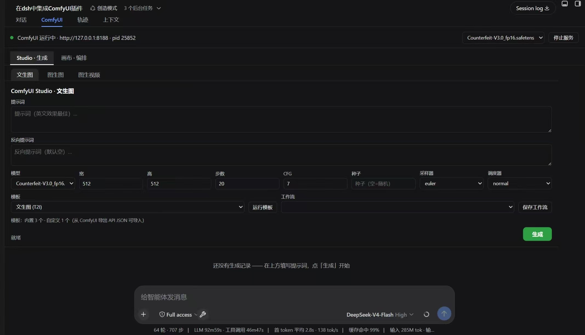
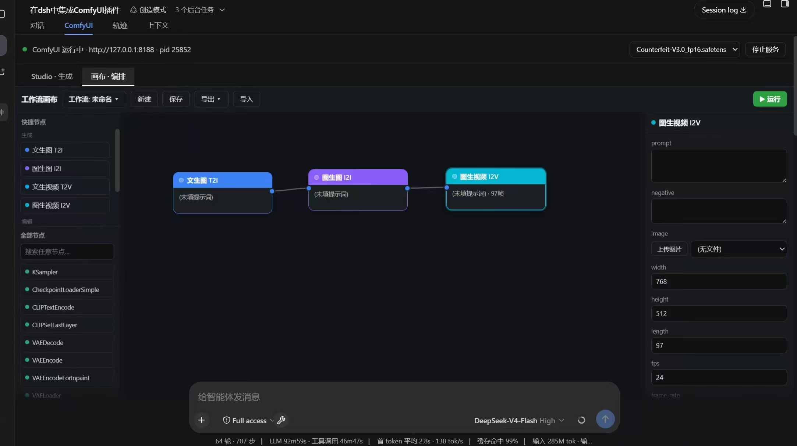

# dsh-comfyui-bridge

**DSH（DeepSeek Harness）上的 ComfyUI 集成插件** —— 在 DSH 中直接驱动 ComfyUI：服务生命周期管理、Studio 生成界面（文生图/图生图/图生视频）、类 ComfyUI 原生的节点画布编排（支持全部 856 种节点）、Agent 自主编排画布与任务模板、工作流保存/导出/导入。

> 内置于会话视图 tab「ComfyUI」：`Studio · 生成` 与 `画布 · 编排` 两个子界面，无需离开 DSH 即可完成 ComfyUI 的建模、生成与管理。

---

## ✨ 功能全景

| 模块 | 能力 |
|---|---|
| **服务管理** | `comfy_start / comfy_stop / comfy_status / comfy_list_models`（幂等启停、自动检测已有实例） |
| **Studio 生成** | 文生图（T2I）、图生图（I2I，本地上传+去噪强度）、图生视频（I2V，LTXV）表单 + 结果画廊（预览/下载/重新生成/删除） |
| **节点画布** | 参照 ComfyUI 原生布局：左侧节点库、中间画布、右侧参数面板；节点拖拽、端口连线（多输出/多输入）、滚轮缩放、中键平移、Delete 删除 |
| **任意节点** | 支持 ComfyUI **全部 856 种节点**（含 custom nodes、云端 API 节点如 Kling/AnimateDiff），schema 驱动多端口与参数表单 |
| **Agent 编排** | Agent 工具：`comfy_canvas_*`（添加节点/连线/设参/运行）+ 画布状态实时同步到前端面板 |
| **任务模板** | `comfy_task`：anime（动漫图）/ promo（宣传海报）/ report（报告配图）/ i2v（图生视频）/ canvas_demo 一键执行 |
| **工作流管理** | 保存/加载/删除（服务端持久化）、导出 API JSON / 画布 JSON、导入（含 ComfyUI API 格式还原） |
| **模型生态** | 多 checkpoint 下拉切换、云端平台模型节点即插即用（Comfy.org API key） |

---

## 📸 界面截图

| Studio · 生成（T2I/I2I/I2V 表单 + 画廊） | 画布 · 编排（类 ComfyUI 原生节点画布） |
|----------------------------------|---------------------------|
|      |   |

---

## 🔧 解决了什么问题

1. **DSH 无法直接驱动 ComfyUI**
   原始 DSH 与 ComfyUI 是两个孤立系统。本插件提供统一入口：服务启停、workflow 提交/轮询/结果取回、图片/视频下载，全部封装为 DSH 工具与面板。

2. **插件装配导致 DSH 启动失败（"有时候启动失败"）**
   - **双路径重复加载**：同时用 `dev_inject_plugin`（注入 registry）与 `dev_install_package`（bundles）会让同一插件在重启时被装配两次 → 工具重复注册 → 启动失败。**方案：统一为 bundles 单路径**（`cordis.patch.yml` 只 insert 一个 host entry，registry 保持空）。
   - **bundle patch 为空**：scaffold 生成的 `cordis.patch.yml` 是空数组，bundle 装配不创建 host entry → 重启后插件 host 半区"消失"。**方案：写入正确的 insert entry**。

3. **面板渲染崩溃（React #130）**
   DSH slot 框架要求 `conversation.view` 的 `component` 是 **React FC**（`(props)=>ReactNode`）且作为 `register(options, component)` 的**第二参数**——脚手架/常见写法（`component: () => ({render})` 或放进 options）都会导致 `React #130 Element type is invalid` 崩溃。**方案：component 改为真正的 React FC，纯 DOM 面板挂载进 FC 容器**。

4. **iframe 内嵌官方前端的 CORS 拦截**
   ComfyUI 官方前端在 DSH 面板 iframe 中因 `origin: null` 被 CORS 拦截（前端 JS 全部加载失败、页面空白）。**方案：ComfyUI 以 `--enable-cors-header` 启动**（允许任意来源加载资源），并最终改为**自研界面**（不依赖 iframe）。

5. **React Flow 打包集成问题**
   `@xyflow/react` 经 rolldown 打包后出现 forwardRef 对象误判、`ReactFlowProvider` 缺失、`style` prop 字符串错误（React #62）等一连串问题。**方案：彻底放弃 React Flow，参照 ComfyUI 源码方式自研轻量画布**（DOM 节点拖拽 + SVG 贝塞尔连线 + 滚轮缩放/中键平移），client 体积从 453KB 降到 78KB。

6. **依赖安装失败**
   插件含 DSH 私有 peerDeps（`@deepseek-ai/*`），直接 `npm install` 会因 npm 解析私有包崩溃。**方案：依赖经 node_modules junction 链接到 DSH checkout**（`scripts/build.sh` 自动处理），npm 依赖（如有）用隔离目录安装。

---

## 🎯 针对 DSH 的专属优化

- **适配 slot 框架**：单一 `conversation.view` 条目（label「ComfyUI」），component 为 React FC，内部子导航 `Studio · 生成 | 画布 · 编排`，符合 DSH 会话视图规范。
- **Agent 工具体系**：工具注册（`ctx.tools.register`）为 DSH 生态标准，Agent 可对话直接驱动 ComfyUI（生成/图生图/画布编排/任务模板），画布状态经 Host 同步到前端实时可见。
- **画布双同步**：前端手动编排与 Agent 编排共享 Host 画布状态（`/canvas/state` 轮询同步），人机协同。
- **数据落位**：历史/工作流/模板存于 `DSH_HOME/comfyui-studio/`，与 DSH 数据目录体系一致。
- **主题适配**：面板全部使用 DSW 主题变量（`--dsw-alias-*`），深浅色自动跟随。
- **重启即用**：bundles 持久装配，重启后插件自动加载；服务可用 `comfy_start` 一键拉起。

---

## 📋 使用前提条件

| 依赖 | 说明 | 检查方式 |
|---|---|---|
| **DeepSeek Harness** | 已安装并初始化 `web` profile（DSH 主程序，插件运行宿主） | `dsh --version` |
| **ComfyUI** | 完整可运行的 ComfyUI 源码目录（插件负责启停，不内置） | 目录含 `main.py`、`models/`、`custom_nodes/` |
| **Python 3.10 + PyTorch** | ComfyUI 运行环境；建议 CUDA 版 torch + NVIDIA GPU | `python -c "import torch;print(torch.cuda.is_available())"` 为 `True` |
| **生成模型** | 至少一个 checkpoint（如 SD1.5 / 动漫模型）放 `models/checkpoints/`；视频功能需 LTXV 2B + T5xxl（放 `diffusion_models/`、`text_encoders/`） | 插件面板模型下拉可见 |
| **ComfyUI 服务可访问** | 默认 `127.0.0.1:8188`，可由插件 `comfy_start` 拉起（或外部启动） | 面板状态条显示"运行中" |
| **云端平台模型（可选）** | 如用 Kling/Veo 等云端节点，需 [Comfy.org](https://comfy.org) API key | 节点参数 `api_key_comfy_org` |

## 📦 安装部署流程

### 第 1 步：获取插件

```bash
git clone https://github.com/Tino577/dsh-comfyui-bridge.git F:\dsh-comfyui-bridge
```

> 也可下载 Release 附件（含 `lib/` 构建产物，跳过第 2 步）。

### 第 2 步：构建（依赖经 junction 链接到 DSH checkout，无需 npm install）

```bash
cd F:\dsh-comfyui-bridge
DSH_CHECKOUT=F:/deepseek-harness bash scripts/build.sh    # 构建 host（lib/index.js）
node F:\deepseek-harness\node_modules\.bin\tsdown.cmd     # 构建 client（lib/client.js）
```

### 第 3 步：装配到 DSH（bundles 持久化，重启自动加载）

在 DSH 会话中向 Agent 发送：

```
dev_install_package {"dir":"F:/dsh-comfyui-bridge"}
```

> 也可用注入方式：`dev_inject_plugin {"dir":"F:/dsh-comfyui-bridge"}`（运行时生效，重启需重注）。

### 第 4 步：准备 ComfyUI

- 确认 `F:\ComfyUI` 可运行（`main.py` + 依赖 + 模型齐全）
- 至少放一个 checkpoint 到 `F:\ComfyUI\models\checkpoints\`
- 视频功能另需 LTXV 模型（见「使用前提条件」）

### 第 5 步：启动与验证

1. **刷新 DSH 页面** → 打开会话 → 视图 tab「ComfyUI」
2. 面板顶部状态条：若 ComfyUI 未运行，点「启动服务」（或对 Agent 说 `comfy_start`）
3. 状态条变绿"运行中"后即可使用：
   - `Studio · 生成`：文生图 / 图生图 / 图生视频 表单生成
   - `画布 · 编排`：节点画布搭建工作流
   - 或直接对话：*"生成一张二次元动漫图：…"*、*"搭一个文生图→放大的画布跑一下"*、*"做个产品宣传海报"*

> **重启 DSH 后**：插件自动装配（bundles）；ComfyUI 服务需再次 `comfy_start`（或手动启动）。

---

## 🛠️ 开发与构建

```bash
# 构建 host（tsc，产物 lib/index.js）
DSH_CHECKOUT=F:/deepseek-harness bash scripts/build.sh
# 构建 client（tsdown，产物 lib/client.js）
node F:\deepseek-harness\node_modules\.bin\tsdown.cmd
# 热更新（DSH 会话中）
dev_reload_package comfyui-bridge
```

> 注意：构建依赖 `node_modules` 内的 junction（指向 DSH checkout 的 `vendor/cordis`、`vendor/schemastery`、`packages/core/tools` 等）由 `scripts/build.sh` 自动创建，缺失时重跑脚本即可。

## 📁 数据目录（`DSH_HOME/comfyui-studio/`）

- `history.json` — 生成历史（最多 200 条）
- `workflows/` — 保存的工作流（画布/表单）
- `templates/` — 自定义模板（ComfyUI API JSON 导入）

## 🔌 Studio API（`/comfyui-studio/api`）

`generate`(t2i/i2i/i2v) · `upload` · `history`(+delete) · `templates`(list/import/import-url/export/delete/run) · `workflows`(save/load/delete) · `canvas`(state/op/run/agent-run/nodes/export/import) · `tasks`(list/run) · `video-models`

---
## 注意：
1. 目前comfyui部分功能还未对接，可以简单在dsh页面使用通过agent操作comfyui
2. 视频图片生成效果与硬件模型有关，需要更多功能扩展可以留言
3. 后续将会持续更新
## 📄 License

BSD-3-Clause
